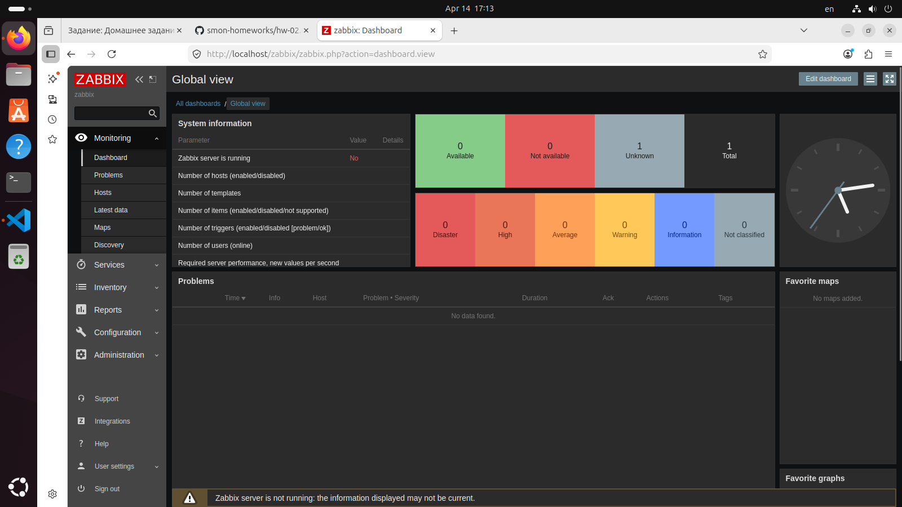
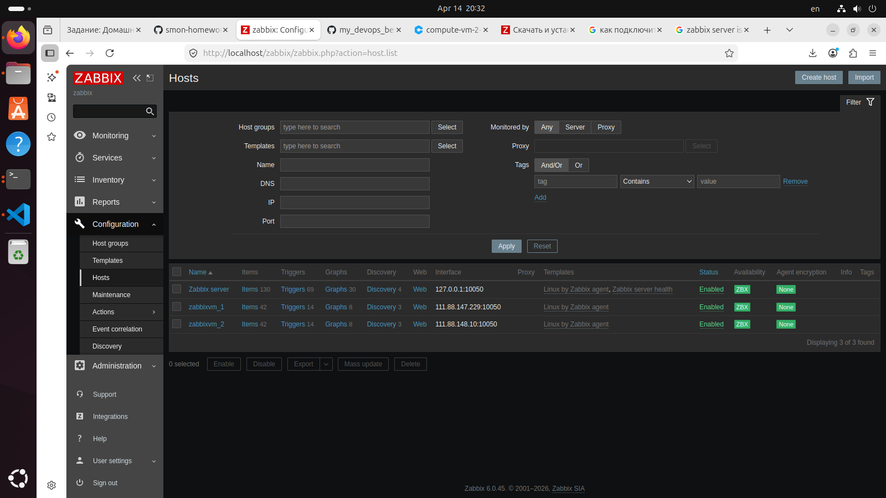
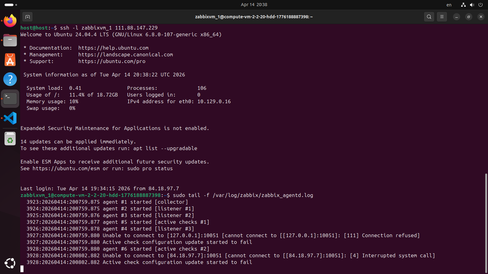
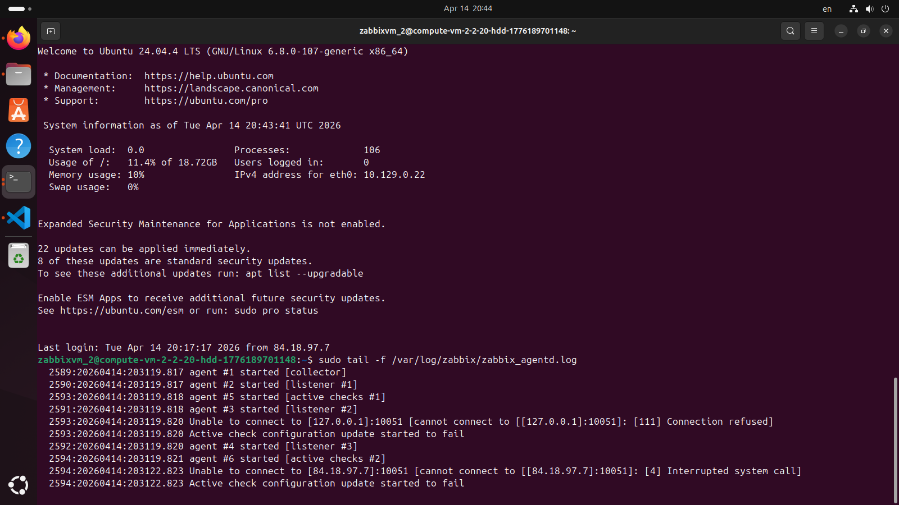
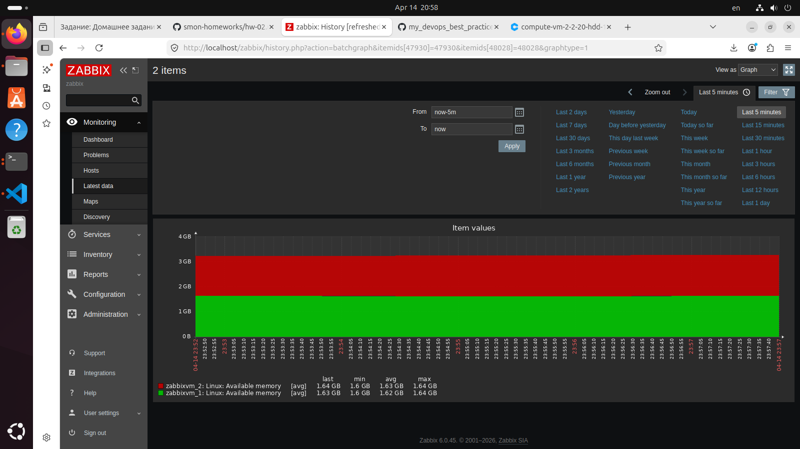
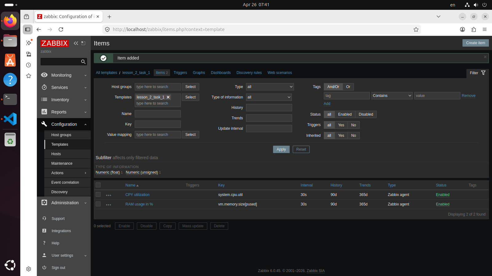
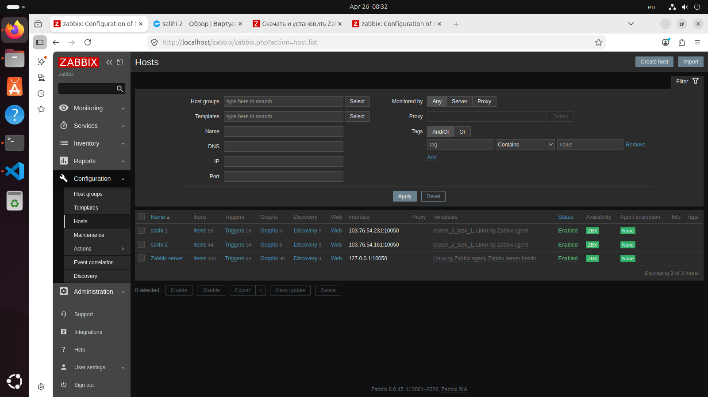
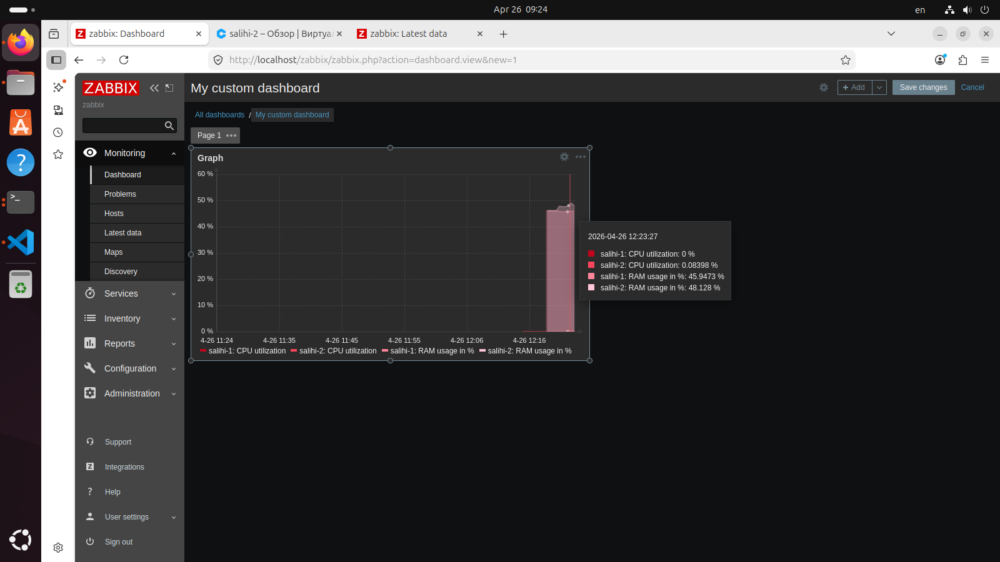

# Урок 1

# Задание 1

## Установите Zabbix Server с веб-интерфейсом.
## Процесс выполнения

    1. Выполняя ДЗ, сверяйтесь с процессом отражённым в записи лекции.
    2. Установите PostgreSQL. Для установки достаточна та версия, что есть в  системном репозитороии Debian 11.
    3. Пользуясь конфигуратором команд с официального сайта, составьте набор команд для установки последней версии Zabbix с поддержкой PostgreSQL и Apache.
    Выполните все необходимые команды для установки Zabbix Server и Zabbix Web Server.

## Требования к результатам

    1. Прикрепите в файл README.md скриншот авторизации в админке.
    2. Приложите в файл README.md текст использованных команд в GitHub.

# Решение

    1. sudo -s
    2. sudo apt update
    3. sudo apt install postgresql
    4. wget https://repo.zabbix.com/zabbix/6.0/ubuntu/pool/main/z/zabbix-release/zabbix-release_latest_6.0+ubuntu24.04_all.deb
    5. dpkg -i zabbix-release_latest_6.0+ubuntu24.04_all.deb
    6. apt install zabbix-server-pgsql zabbix-frontend-php php8.3-pgsql zabbix-apache-conf zabbix-sql-scripts zabbix-agent
    7. sudo -u postgres createuser --pwprompt zabbix
    8. sudo -u postgres createdb -O zabbix zabbix
    9. zcat /usr/share/zabbix-sql-scripts/postgresql/server.sql.gz | sudo -u zabbix psql zabbix
    10. nano /etc/zabbix/zabbix_server.conf
    11. ctrl+w > DBPassword = *****
    12. systemctl restart zabbix-server zabbix-agent apache2
    13. systemctl enable zabbix-server zabbix-agent apache2
    14. http://localhost/zabbix

## Админка

# Задание 2

## Установите Zabbix Agent на два хоста.
## Процесс выполнения

    1. Выполняя ДЗ, сверяйтесь с процессом отражённым в записи лекции.
    2. Установите Zabbix Agent на 2 вирт.машины, одной из них может быть ваш Zabbix Server.
    3. Добавьте Zabbix Server в список разрешенных серверов ваших Zabbix Agentов.
    4. Добавьте Zabbix Agentов в раздел Configuration > Hosts вашего Zabbix Servera.
    5. Проверьте, что в разделе Latest Data начали появляться данные с добавленных агентов.

## Требования к результатам

    1. Приложите в файл README.md скриншот раздела Configuration > Hosts, где  видно, что агенты подключены к серверу
    2. Приложите в файл README.md скриншот лога zabbix agent, где видно, что он работает с сервером
    3. Приложите в файл README.md скриншот раздела Monitoring > Latest data для обоих хостов, где видны поступающие от агентов данные.
    4. Приложите в файл README.md текст использованных команд в GitHub

# Решение

    1. ВМ созданы на YC
      A. zabbixvm_1
      B. zabbixvm_2
    2. ssh -l zabbixvm_1 111.88.147.229
    3. sudo -s
    4. wget https://repo.zabbix.com/zabbix/6.0/ubuntu/pool/main/z/zabbix-release/zabbix-release_latest_6.0+ubuntu24.04_all.deb
    5. dpkg -i zabbix-release_latest_6.0+ubuntu24.04_all.deb
    6. apt update
    7. в конфге добавляем Server и ServerActive адрес сервер хоста
    8. systemctl restart zabbix-agent
    9. systemctl enable zabbix-agent
    10. ssh -i ~/.ssh/ssh-key-1776189037803 zabbixvm_2@111.88.148.10
    11. Повторяем для второй машины

## Configuration>hosts

## zabbixvm_1

## zabbixvm_2

## latest data

# Урок 2

# Задание 1

## Создайте свой шаблон, в котором будут элементы данных, мониторящие загрузку CPU и RAM хоста.
## Процесс выполнения
1. Выполняя ДЗ сверяйтесь с процессом отражённым в записи лекции.
2. В веб-интерфейсе Zabbix Servera в разделе Templates создайте новый шаблон
3. Создайте Item который будет собирать информацию об загрузке CPU в процентах
4. Создайте Item который будет собирать информацию об загрузке RAM в процентах

## Требования к результату
 1. Прикрепите в файл README.md скриншот страницы шаблона с названием «Задание 1»

# Решение

# Задание 2

## Добавьте в Zabbix два хоста и задайте им имена <фамилия и инициалы-1> и <фамилия и инициалы-2>. Например: ivanovii-1 и ivanovii-2.
## Процесс выполнения
1. Выполняя ДЗ сверяйтесь с процессом отражённым в записи лекции.
2. Установите Zabbix Agent на 2 виртмашины, одной из них может быть ваш Zabbix Server
3. Добавьте Zabbix Server в список разрешенных серверов ваших Zabbix Agentов
4. Добавьте Zabbix Agentов в раздел Configuration > Hosts вашего Zabbix Servera
5. Прикрепите за каждым хостом шаблон Linux by Zabbix Agent
6. Проверьте что в разделе Latest Data начали появляться данные с добавленных агентов

## Требования к результату
 1. Результат данного задания сдавайте вместе с заданием 3

 # Задание 3

 ## Привяжите созданный шаблон к двум хостам. Также привяжите к обоим хостам шаблон Linux by Zabbix Agent.
 ## Процесс выполнения
1. Выполняя ДЗ сверяйтесь с процессом отражённым в записи лекции.
2. Зайдите в настройки каждого хоста и в разделе Templates прикрепите к этому хосту ваш шаблон
3. Так же к каждому хосту привяжите шаблон Linux by Zabbix Agent
4. Проверьте что в раздел Latest Data начали поступать необходимые данные из вашего шаблона

## Требования к результату
 1. Прикрепите в файл README.md скриншот страницы хостов, где будут видны привязки шаблонов с названиями «Задание 2-3». Хосты должны иметь зелёный статус подключения

# Решение

# Задание 4

## Создайте свой кастомный дашборд.
## Процесс выполнения
1. Выполняя ДЗ сверяйтесь с процессом отражённым в записи лекции.
2. В разделе Dashboards создайте новый дашборд
3. Разместите на нём несколько графиков на ваше усмотрение.

## Требования к результату
 1. Прикрепите в файл README.md скриншот дашборда с названием «Задание 4»

# Решение

